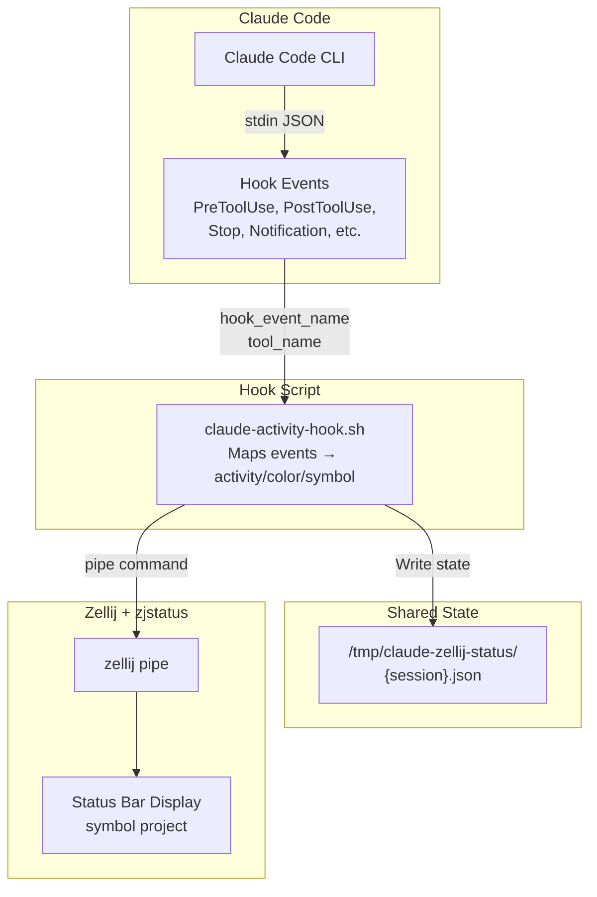

# Claude Code Zellij Status

Monitor Claude Code activity across multiple Zellij panes in real-time via zjstatus.

## Preview


## Installation

### Requirements

- [Zellij](https://zellij.dev/documentation/installation.html) terminal multiplexer
- [zjstatus](https://github.com/dj95/zjstatus/wiki/1-%E2%80%90-Installation) plugin
- [Claude Code](https://claude.ai/code) CLI

### Step 1: Install the Plugin

```bash
claude plugin marketplace add https://github.com/thoo/claude-code-zellij-status.git
claude plugin install cc-zjstatus
```

### Step 2: Configure Zellij Layout

Copy the `default.kdl` file to your Zellij layouts directory:

```bash
cp default.kdl $HOME/.config/zellij/layouts/default.kdl
```

For more information on zjstatus configuration, see the [zjstatus Installation Guide](https://github.com/dj95/zjstatus/wiki/1-%E2%80%90-Installation).

### Step 3: Restart Zellij

Restart your Zellij session or open a new tab to apply the layout changes.

## Features

- Real-time activity monitoring across all Claude Code sessions in a Zellij session
- Color-coded symbols for instant recognition
- Automatic cleanup when sessions end
- zjstatus notifications for important events (done, asking, permission needed)

## Symbol Reference

| Symbol | Color | Default | Meaning |
|--------|-------|---------|---------|
| `●` | yellow | `yellow` | Working/Active |
| `◐` | gray | `bright_black` | Thinking |
| `◍` | blue | `blue` | Web searching |
| `↓` | blue | `blue` | Web fetching |
| `◔` | blue | `blue` | Reading file |
| `◎` | blue | `blue` | Finding (glob/grep) |
| `✎` | aqua | `cyan` | Writing/Editing |
| `⚡` | orange | `bright_red` | Running bash |
| `▶` | purple | `magenta` | Agent running |
| `▷` | green | `green` | Agent done |
| `★` | purple | `magenta` | Skill |
| `◈` | purple | `magenta` | MCP tool |
| `◫` | yellow | `yellow` | Planning (todo) |
| `?` | red | `red` | Asking user |
| `⚠` | red | `red` | Permission needed |
| `!` | red | `red` | Notification |
| `✓` | green | `green` | Done |
| `◆` | blue | `blue` | Session started |
| `○` | gray | `bright_black` | Idle |

## Color Scheme

By default, colors use ANSI named colors so they adapt to your terminal theme:

| Name | Default | Usage |
|------|---------|-------|
| green | `green` | Complete/Done |
| yellow | `yellow` | Active/Working |
| blue | `blue` | Reading/Searching |
| aqua | `cyan` | Writing/Editing |
| red | `red` | Needs attention |
| orange | `bright_red` | Bash commands |
| purple | `magenta` | Agent/Skill/MCP |
| gray | `bright_black` | Thinking/Idle |
| project | `cyan` | Project name text |

### Custom Colors

Override any color by creating `~/.config/cc-zjstatus/colors.ini`:

```ini
# Supported formats:
#   ANSI names:  red, green, blue, bright_blue, magenta, cyan, etc.
#   Hex codes:   #ff4136
#   ANSI 256:    0..255

# Only override the colors you want to change.
# Example: Catppuccin Mocha
green   = #a6e3a1
yellow  = #f9e2af
blue    = #89b4fa
aqua    = #94e2d5
red     = #f38ba8
orange  = #fab387
purple  = #cba6f7
gray    = #585b70
project = #89b4fa
```


## How It Works



### Data Flow

1. **Claude Code** emits hook events (PreToolUse, PostToolUse, Stop, etc.) as JSON via stdin
2. **Hook script** parses the event and maps it to an activity, color, and symbol
3. **State file** stores status for all Claude Code panes in the Zellij session
4. **zjstatus** receives pipe message and displays combined status in the status bar

## Files

- `claude-activity-hook.sh` - Hook script that captures Claude Code events and updates zjstatus
- State files stored in `/tmp/claude-zellij-status/`

## License

MIT
